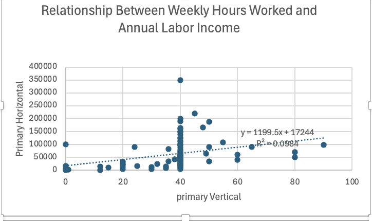
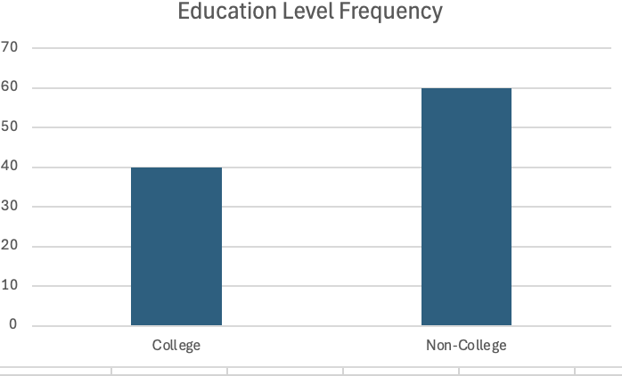

# 📊 Supply Chain Optimization Model

This project demonstrates how Excel and Solver can be used to perform optimization and data analysis for business decision-making.

## 🔍 Overview
In this project, I analyzed the relationship between weekly hours worked and annual income using real-world data. I used Excel tools and Solver concepts to explore patterns and support data-driven insights.

## 📈 Key Features
- Data cleaning and preparation in Excel
- Analysis of weekly hours vs income
- Scatter plot visualization with trendline
- Identification of patterns in income distribution
- Use of analytical thinking for decision support

## 📊 Insights
- A positive relationship exists between hours worked and income
- Some outliers indicate variability in earnings
- Data visualization helps identify trends and support conclusions

## 🛠 Tools Used
- Microsoft Excel
- Data Analysis
- Visualization (Scatter Plot)
- Solver (Optimization concepts)

## 📸 Project Preview

## 🚀 What I Learned
- How to analyze real-world data in Excel
- How to visualize relationships using charts
- How to apply problem-solving and analytical thinking
- How to communicate insights clearly

---

💡 This project is part of my journey in Business Analytics and data-driven decision making.
